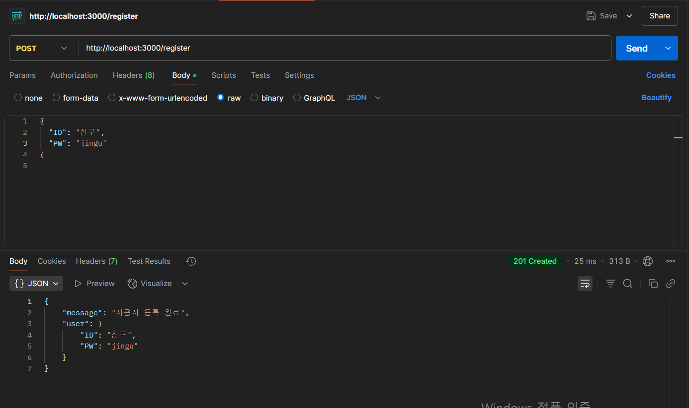
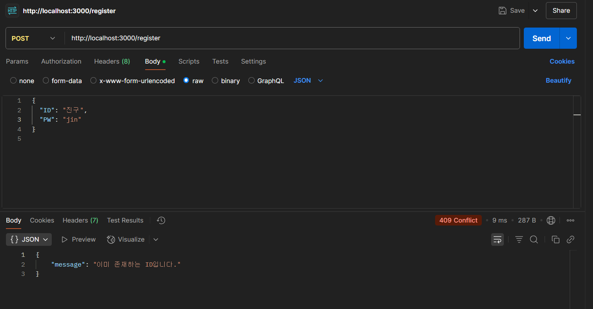
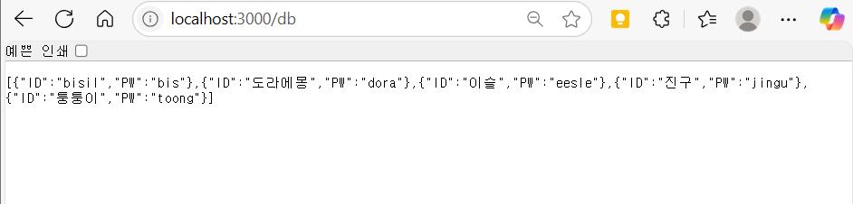

# Node.js + Express + MySQL 회원가입 API 프로젝트

---

## 📌 목적

이 프로젝트는 Node.js와 Express, MySQL을 활용해  
기본적인 회원 정보를 post 및 get을 구현해보는 것이 목적 

---

## ⚙️ 과정

### 1. 개발 환경 구성
- 새 폴더 생성
- 프로젝트 폴더 생성 후 Express 초기화:
  ```bash
  npm init -y
  npm install express mysql2

 ### 2. MySQL 테이블 만들기
 ```bash
 CREATE DATABASE if  not exists wonyeong;
use wonyeong;

CREATE TABLE users (
    ID VARCHAR(50) NOT NULL PRIMARY KEY,
    PW VARCHAR(255) NOT NULL
);

### 3. 서버(app.js) 코드 작성
/register: POST 요청을 통해 사용자 ID, PW 저장

/db: GET 요청을 통해 등록된 모든 사용자 조회

### 4. API 테스트 (Postman 활용)
POST /register
ID, PW를 입력하면 DB에 저장

중복 ID 등록 시 에러 반환

GET /db
저장된 모든 사용자 정보(ID, PW) 조회 가능

### 5. 📸 API 테스트 결과

회원 등록 (POST /register)



사용자 목록 조회 (GET /db)

